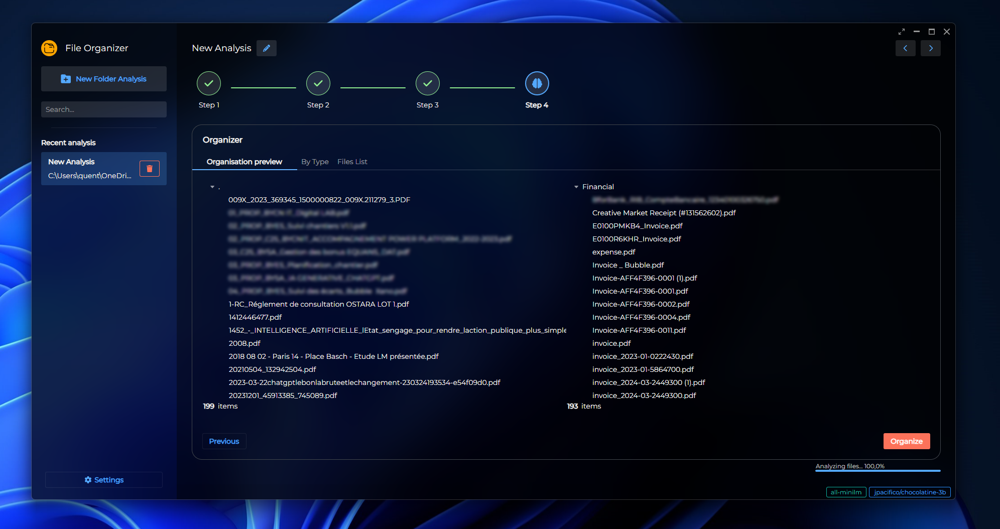
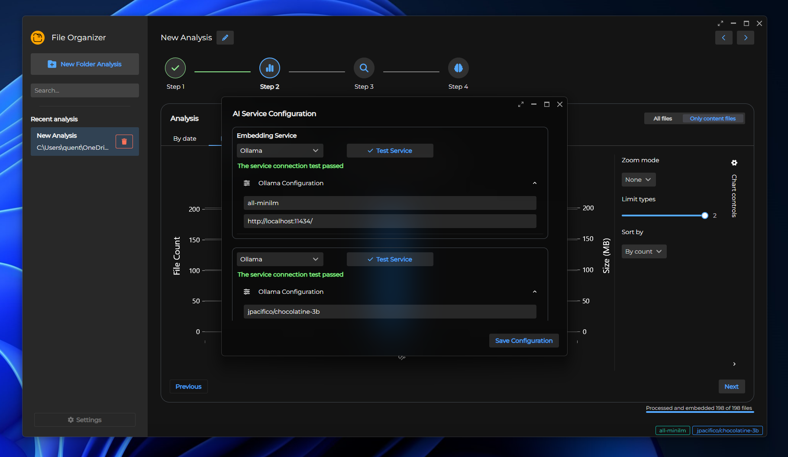

# File Organizer: AI-Driven Folder Analysis and File Management

Tired of endless file chaos? Let AI step in! The **File Organizer** is a cross-platform app (Windows and macOS) that helps you analyze, search, and reorganize files in a more efficient, structured way. With built-in AI capabilities (local or via API), it ensures you can streamline your file management process without compromising on privacy.

## Key Features

- **Folder Analysis by Types and Sizes:** Gain insights into what’s inside your folders by visualizing file types, sizes, and more using powerful analysis tools.
- **AI-Driven Vector Search:** Use cutting-edge AI to search for specific content within files using semantic search based on vector embeddings.
- **Efficient File Reorganization:** Automatically reorganize your files based on content, type, or custom rules, ensuring a clean and logical structure.

## How It Works 💡

Imagine you have a messy folder filled with different files like PDFs, images, and text documents. This app helps you by:

1. **Analyzing** the folder's content (based on file type, size, and other metadata).
2. **Searching** for specific terms or content in files using AI-powered vector search.
3. **Reorganizing** files into an optimized, structured format based on efficiency and space management.

Before:

```
/home/user/downloads/
├── photo_20231021_140322.jpg
├── photo_20231022_083045.jpg
├── photo_20231023_192130.jpg
├── yearly_budget_2024.xlsx
├── team_meeting_10212023.txt
├── project_plan_draft.docx
├── ideas.txt
├── chocolate_chip_cookies_recipe.pdf
├── scanned_invoice.pdf
└── conference_presentation.pptx

0 directories, 10 files

```

After:

```
/home/user/organized_downloads/
├── Financial
│   └── yearly_budget_2024.xlsx
├── Food_and_Recipes
│   └── chocolate_chip_cookies_recipe.pdf
├── Meetings_and_Notes
│   └── team_meeting_10212023.txt
├── Personal
│   └── ideas.txt
├── Photos
│   ├── photo_20231021_140322.jpg
│   ├── photo_20231022_083045.jpg
│   └── photo_20231023_192130.jpg
├── Work
│   ├── project_plan_draft.docx
│   ├── scanned_invoice.pdf
└── Presentations
    └── conference_presentation.pptx

7 directories, 10 files

```

## Demo




## Updates 🚀

**[2024/10] v1.0.0:**
- Initial release
- Folder analysis based on file type and size
- Vector search using local AI models or external APIs
- Auto-file reorganization for efficient storage

## Roadmap 📅

- Integrate file duplication check
- Add support for audio/video file analysis
- Enable more flexible reorganization rules based on user input
- Dockerfile for easier setup and deployment

## Supported File Types 📁

- **Text Files:** .pdf, .docx
- **Spreadsheets:** .xlsx, .csv *(Not yet supported)*
- **Presentations:** .ppt, .pptx *(Not yet supported)*
- **Images:** .jpg, .jpeg, .png, .bmp *(Not yet supported)*
- **PDFs:** .pdf *(Supported only as text files for now)*

## Prerequisites 💻

- **Operating System:** Compatible with **Windows** and **macOS**.
- **AI Models:** Supports both local AI processing (privacy-first) and external AI APIs (optional).
- **.NET Core Runtime:** Ensure you have .NET Core installed for running the app.
  
## Installation & Setup

1. Clone the repository:
   ```bash
   git clone https://github.com/yourusername/file-organizer.git
Install dependencies and build the app.
Run the app locally, and start organizing your files!
